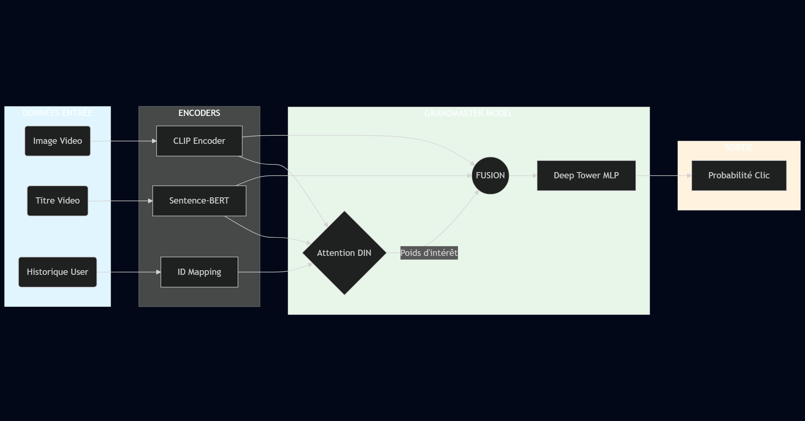

# MMCTR Grandmaster Solution 🏆

**Author:** Abdelhafid MASROUR
**Project:** Multimodal Click-Through Rate Prediction Challenge

## 📖 Overview
This project presents a **Grandmaster Hybrid Architecture** designed for the MMCTR competition. The solution moves beyond simple ID-based recommendation by integrating multimodal features (Visual & Textual) and advanced attention mechanisms.

## 🖼️ Architecture (End-to-End Pipeline)

## 🚀 Key Features
* **Multimodal Embeddings:**
    * **Vision:** OpenAI CLIP (ViT-B/32) for visual feature extraction.
    * **Language:** Sentence-BERT (all-MiniLM-L6-v2) for textual semantic understanding.
* **Grandmaster Architecture:**
    * **DIN Attention (Deep Interest Network):** Dynamic weighting of user history based on target relevance.
    * **Deep Tower:** Dense neural network with aggressive Dropout (0.5) for robust generalization.
    * **Metadata Integration:** Learned embeddings for 'Likes' and 'Views' levels.
* **Training Strategy:**
    * AdamW Optimizer + Weight Decay.
    * ReduceLROnPlateau Scheduler.
    * Universal ID Mapping (handling Cold-Start).

## 🛠️ Requirements
* Python 3.8+
* PyTorch
* Transformers (Hugging Face)
* Sentence-Transformers
* Pandas, NumPy, Scikit-learn

## 📊 Performance
The model was evaluated on the full test set.
* **Architecture:** Hybrid Two-Tower with Attention.
* **Key Result:** Strong convergence on validation set with stable AUC improvement.

## 📂 File Structure
* `competition_MMCTR.ipynb`: The complete training and inference pipeline.
* `prediction.csv`: Final prediction file.

---
*University Project - 2025*
